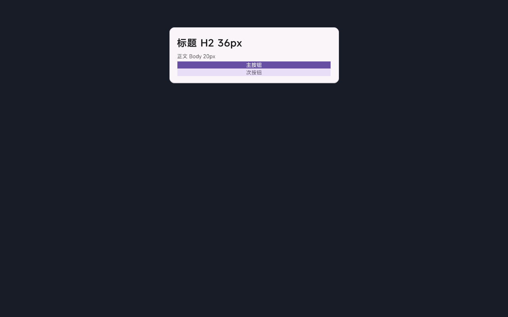
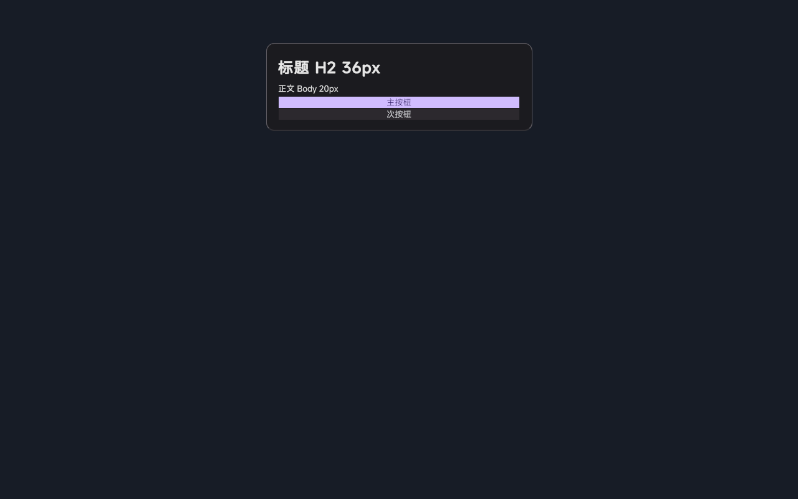

English | [简体中文](README.zh-CN.md)

# A2UI Unity Toolkit

**Render Agent-generated UI natively in Unity / Tuanjie. No HTML, no WebView, no pixel streaming.**

[](LICENSE)


[](https://a2ui.org)

A2UI is an open protocol by Google (Apache 2.0, [a2ui.org](https://a2ui.org)). Official renderers cover Angular, Flutter/GenUI and Lit; a community Compose renderer lives at `lmee/A2UI-Android`. This toolkit is the Unity UI Toolkit runtime for that protocol. Point an Agent (cloud or local Ollama) at your app and its output becomes native, themeable UI Toolkit components. Built for in-vehicle cockpits, games, and any Unity front-end driven by AI.

| M3 Light | M3 Dark |
|---|---|
|  |  |

▶ [Watch the scrolling demo](screenshots/demo_v09_full_control_scroll.mp4)

```
Agent (JSONL) ──HTTP/TCP──▶ Host hot-push ──▶ G0 validation ──▶ Processor FSM ──▶ CatalogMapper ──▶ UI Toolkit
   createSurface /            127.0.0.1:18766     │             surface           protocol→UITK     USS theming
   updateComponents /                             └─ bad packets rejected,
   updateDataModel /                                 last frame kept
   deleteSurface
```

## Why this exists

GenUI (Agent-generated interfaces) hits three hard problems in cockpit and game scenarios. This runtime addresses each one.

1. **Protocol boundary.** The Agent only produces A2UI JSONL (one message per line, whitelisted component types). No arbitrary code, no raw styling. Structure is constrained by the protocol, and injection is rejected by G0 validation.
2. **Rendering normalization.** The same JSONL renders under any theme via hot-switching (DS design system, M3 Light and Dark, Figma-exported skins). Structure and skin stay orthogonal.
3. **Regression safety.** A full matrix (every theme against every sample, 500+ combos) with layout assertions and screenshot diff verifies nothing broke anywhere, with one command.

**Protocol support is a dual stack.** The engine auto-detects the message format per line. Legacy v0.8 (`surfaceUpdate`/`beginRendering`, nested components) and current v0.9 (`createSurface`/`updateComponents`, flat components, direct text values) both render. `A2uiV09Normalizer` folds v0.9 into the internal model, so the mapper is version-agnostic.

## Quick start

Requires **Tuanjie 2022.3.62t13** (verified; a Unity 2022.3-compatible fork, stock Unity unverified) and **Python 3.10+** for the tooling.

```bash
git clone https://github.com/SamXiaBing/a2ui-unity-toolkit.git
# open the project with Tuanjie — it runs as-is
```

Open `Assets/Scenes/A2UITestBed.unity`, press Play, then pick one of the three entry points.

**A. Editor push panel.** Menu `A2UI Scheme A → 测试发送面板`. Pick a sample (grouped, tagged v0.8/v0.9), click 发送, hot-switch themes.

**B. Scripted hot-push** (simulate an Agent stream).

```bash
python Tools/push_a2ui_bench.py --jsonl-file Assets/A2UISchemeA/Samples/demos/full_control_center.v0.9.jsonl --prompt "all controls"
```

**C. One-command regression.**

```bash
python Tools/run_regression.py --editor "D:/Program Files/Tuanjie 2022.3.62t13/Editor/Tuanjie.exe"
# no dedicated GPU: --only-geometry skips screenshots; --update-baselines refreshes baselines
```

## Repository layout

```
Assets/A2UISchemeA/
├── Runtime/    protocol processor (v0.8/v0.9 dual-stack), CatalogMapper, hosts, theme registry
├── Editor/     push panel, USS editor, atomic-component workbench
├── Styles/     USS: DS design system (15 files), M3 tokens, FigmaExport skin
├── Samples/    56 samples in dual formats: demos / scenarios / features / components / edge / timeline_bench
├── Tests/      full-matrix layout regression + mapper/protocol unit tests
├── Scenes/     test bed scenes
├── Design/     design-spec HTML (tokens & components), Figma component-kit plugin script
└── Resources/  MiSans font (bundled) + 120+ SVG icons
Tools/          Python toolchain: push, regression, diff, Figma import, v0.8→v0.9 converter
docs/           engine compatibility matrix (read before touching USS!), Figma pipeline status
screenshots/    demo captures
```

## Theming

- Built-in themes are **DS** (design system, default), **M3 Light**, **M3 Dark**, plus auto-discovered **Figma Export**
- **Zero-code extension.** Drop a `FigmaTokens.uss` (plus optional `FigmaComponents.uss`) into any subfolder of `Styles/` and the registry discovers it as a new theme; the panel and dropdowns grow a matching entry automatically
- Themes are a USS scope class plus C# inline fallback colors (engine descendant-selector quirks; see the compat matrix)
- The DS theme and the 120-icon set derive from [sinanata/unity-ui-toolkit-design-system](https://github.com/sinanata/unity-ui-toolkit-design-system) (MIT, see [THIRD-PARTY-NOTICES.md])(THIRD-PARTY-NOTICES.md)
- Legacy decorative skins (ice/beach/pink/green/aaos/cloud) were trimmed; `/theme` requests for them fall back to DS

## Figma → USS pipeline

The Figma path is implemented end to end (plugin → export → token/component USS → hot-switchable theme).

1. **Template.** `Design/a2ui-design-spec.html` holds the token table and component spec; `Tools/figma_plugin/` builds the A2UI component kit inside Figma
2. **Export.** `Tools/figma_api_export.py` talks to the Figma REST API (sample boards in `Tools/figma_samples/`)
3. **Convert.** `Tools/figma_pull_tokens.py` produces `FigmaTokens.uss`, `Tools/figma_to_uss.py` produces `FigmaComponents.uss`
4. **Consume.** `Assets/A2UISchemeA/Styles/FigmaExport/` is discovered as a hot-switchable theme; visual test in `A2uiFigmaExportVisualTest`

Current fidelity (honest assessment in [docs/figma_pipeline_status.md](docs/figma_pipeline_status.md)). **L1 colors pass, L2 type/spacing is partial, L3 layout constraints not started** (component USS values are generator-hardcoded, not yet parsed from Figma Auto Layout).

## Testing strategy

| Layer | Test | Historical incidents encoded |
|-------|------|------------------------------|
| Mapper | `A2uiMapperUnitTests` (7 cases) | Column wrap false-parallel, Tab equal-split overflow, missing `:last-child`, detached-animation crash, button text source, binding priority, List tail |
| Protocol | `A2uiValidatorProcessorTests` | bad-packet rejection, surface lifecycle, path patch, array indices |
| Layout | `A2uiLayoutRegressionTest` full matrix | any theme × any sample text overflow + Image collapse |
| Visual | `Tools/regression_diff.py` screenshot diff | perceptual regressions from USS changes (0.5% pixel threshold) |

Layout regression auto-discovers `Samples/**/*.jsonl`; v0.8 and v0.9 samples both enter the matrix.

## Robustness & security model

Agent-generated JSONL is **untrusted input**. The renderer defends like a browser rendering web pages, aligned with the A2UI Compose reference renderer's safety baseline.

| Defense | Limit / policy | Behavior |
|---------|----------------|----------|
| Render depth | `MAX_RENDER_DEPTH = 50` | deeper nesting renders placeholder, no stack overflow |
| Component ID validation | protocol ID rules | invalid ID skips that component only |
| Bad packet G0 rejection | structural validation | rejected, **previous frame kept** (no white screen) |
| Unknown component | `A2uiDegrade.UnknownTypeFallback` | placeholder card, no crash |
| Missing children | `Placeholder(missing:id)` | local placeholder, siblings render |
| URL scheme allowlist | Image/Video/AudioPlayer `http(s)` only; local via `resources://` | blocks `file://` / custom-scheme injection |
| JSON parse tolerance | per-line failure reports line number | no silent swallowing |
| Style parse isolation | malformed USS entries never reach runtime | engine style traversal never crashes |

> Layout contract. The **host fixes the width (640px standard card, max-width 96%)** and components fill with `flex-shrink:1`, matching the Compose reference renderer's `fillMaxWidth()` convention. Taller-than-viewport content scrolls inside the card (ScrollView). Fixed component sizes (image heights etc.) match the reference dp values.

## Roadmap

Remaining enhancements, tracked against the A2UI Compose reference renderer.

- [ ] Long-list virtualization (LazyColumn/LazyRow; the current ScrollView renders fully, fine for cockpit card scale)
- [ ] TextField two-way DataModel binding (currently via action write-back)
- [ ] Message size cap (the reference implementation caps at 1MB) and per-surface component cap (reference 1000)
- [ ] Automated dp-consistency tests for standard component sizes vs the reference renderer
- [ ] Full baseline screenshot capture (GUI editor required, `A2UI_CAPTURE=1`)

## Key documents

- **[Tuanjie UITK compatibility matrix](docs/engine-compat-tuanjie.md)**. 30+ measured engine pitfalls (transform crash, flex-shrink default 0, var() fallback dropped, Column wrap traps). Read before changing USS or the Mapper.
- [Figma pipeline status](docs/figma_pipeline_status.md). What works, what doesn't, and why
- [Protocol v0.8 → v0.9 upgrade notes](docs/protocol_upgrade_v0_9.md)
- [MiSans font license](docs/FONT-LICENSE-MiSans.md)
- Chinese docs in [README.zh-CN.md](README.zh-CN.md); subdirectory notes in [Assets/A2UISchemeA/README.md](Assets/A2UISchemeA/README.md)

## License

MIT (see [LICENSE](LICENSE)). Third-party assets (MiSans font, DS theme and icon set) are redistributed under their own licenses, see [THIRD-PARTY-NOTICES.md](THIRD-PARTY-NOTICES.md).
