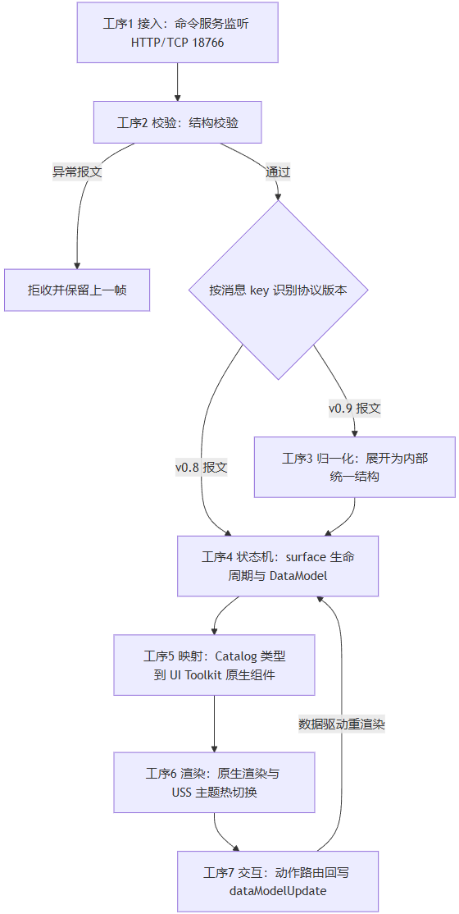
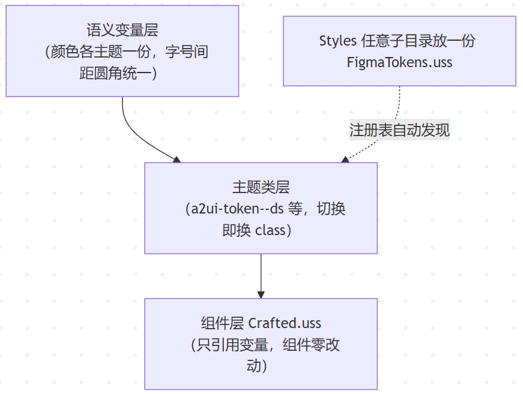

# GenUI for In-Vehicle Cockpits: Rendering the A2UI Protocol with Native Unity UI Toolkit

> English translation of the Chinese original (September 2026): [WeChat Official Account](https://mp.weixin.qq.com/s/UFqDQDhYucKRuFd-JyHMOg) ｜ [Zhihu](https://zhuanlan.zhihu.com/p/2079675042464523426). Repo archive; diagrams retained from the Chinese original. 中文版见 [article.zh-CN.md](article.zh-CN.md)。

> **Key takeaways**
>
> - Repo: [https://github.com/SamXiaBing/a2ui-unity-toolkit](https://github.com/SamXiaBing/a2ui-unity-toolkit)
>
> - A comparison of GenUI technical routes for in-vehicle cockpits, and the trade-offs of native component mapping.
> - The pipeline design behind A2UI rendering.
> - An automated pipeline from Figma design files to USS themes.
> - The regression-testing capability shipped in the open-source repo.

## Why does A2UI need a Unity renderer?

Generative UI (GenUI) means an AI Agent describes the interface structure and the client renders it in real time. The A2UI protocol proposed by Google uses JSONL as its message format and defines a standard specification for component descriptions, hierarchy, data binding and action callbacks. Official renderers cover Angular, Flutter, Lit and other web/mobile frameworks; the community also maintains a Compose renderer.

In in-vehicle cockpit 3D HMI development, the UI runs inside a 3D engine environment (say, Tuanjie) and renders on the engine's own UI canvas system (say, UI Toolkit). The existing A2UI ecosystem has no implementation for that.

The implementation described in this article maps the A2UI protocol directly onto native Unity UI Toolkit components. JSONL packets produced by the Agent are validated, converted and mapped, then rendered as native components — no HTML, no WebView, no pixel streaming.

The project supports the v0.8/v0.9 dual stack, theme hot-switching, automatic Figma-to-theme conversion, and automated regression across every theme × every sample. The open-source material includes 23 runtime C# files, an 18-script Python toolchain, 21 component types, 3 built-in themes and 56 samples. The repo is released under the MIT license.

## Thinking through the technical routes

There are several comparable routes to AI-driven cockpit GenUI.

### **The WebView plugin route**

Render the UI with the web stack: the Agent outputs HTML or web-like descriptions. Implementation cost is low and the ecosystem is mature. But Unity cannot render HTML/CSS directly — you depend on a third-party plugin such as Vuplex 3D WebView, compositing through off-screen textures into the 3D scene, with an extra pixel copy every frame. The performance cost is significant, and the adaptation cost in 3D HMI projects is not low either.

### **The Compose bridge route**

Forward Android Compose draw commands into Unity, map them at the API level and finish rendering there. You reuse the Android ecosystem, and the declarative paradigm fits GenUI structure descriptions naturally. But it requires modifying Android Framework code — the risk and difficulty run high — and once you are bound to Compose, the technical scope on the 3D side is constrained.

### **The native-component (UITK) mapping route**

Treat the model output as a structural protocol and map it directly onto native Unity UI Toolkit components. UI Toolkit's declarative styling is semantically aligned with the web design system: it has Flex layout, and USS property naming, selector mechanics and the variable system closely resemble CSS. That means design-side Figma design systems and front-end styles can be converted into USS themes through an automated pipeline, instead of rewriting a set of visual assets from scratch. On top of that, performance is fully controllable. The price: you implement the protocol-to-component mapping layer yourself.

## Core challenges

The native-component mapping route raises three families of technical problems.

**Adapting the rendering host to the protocol.** UI Toolkit's layout, styling system and component set differ from the web/Android ecosystems. Flex behavior, scrolling mechanics and transform properties are inconsistent in places; the mapping layer must adapt to them one by one, so that the semantics of the protocol-described UI present correctly on the 3D engine side.

**Multi-version protocol compatibility.** A2UI v0.8 and v0.9 differ in packet structure: v0.8 describes components nested, with the type expressed as the nested key; v0.9 is a flat component array where `children` reference IDs directly. Compatibility requires an internal data layer — a version-decoupled intermediate model produced by JSONL conversion — so that a protocol upgrade leaves the mapping layer unchanged.

**Engineering the visual assets.** The visual quality of generative UI depends on the theme system, not on the model output. Building a theme pipeline that is extensible, verifiable and auto-convertible from design files — not the architecture itself — is the deciding factor for system usability.

## System architecture

The JSONL packet flow goes through seven stages:



### Data-driven mode

User actions never mutate the UI directly; they are routed as actions into the vehicle service, and after the service writes data back, the UI updates automatically from the data:


### Protocol compatibility

**A v0.8 packet** (nested):

```
{
  "surfaceId": "demo",
  "column": {
    "children": [
      {
        "text": {
          "text": "有点热，调到 22 度",
          "variant": "h4"
        }
      },
      {
        "button": {
          "text": "确认",
          "action": "confirm"
        }
      }
    ]
  }
}
```

**A v0.9 packet** (flat):

```
{"version":"v0.9","createSurface":{"surfaceId":"demo","catalogId":".../standard_catalog_definition.json"}}
{"version":"v0.9","updateComponents":{"surfaceId":"demo","components":[
  {"id":"root","component":"Column","children":["title","b1"]},
  {"id":"title","component":"Text","text":"有点热，调到 22 度","variant":"h4"},
  {"id":"b1","component":"Button","text":"确认","action":"confirm"}
]}}
```

In v0.8 the component type is nested inside the key and the structure is a recursive tree;

in v0.9 the type sits in the `component` field and the structure is a flat array plus `children` referencing IDs, which needs an extra pass to rebuild the tree.

The normalized internal data model (both versions converge into the same one):

```
{
  "surfaceId": "demo",
  "rootId": "root",
  "components": {
    "root":  { "type": "Column", "children": ["title", "b1"], "props": {} },
    "title": { "type": "Text",   "children": [],             "props": { "text": "有点热，调到 22 度", "variant": "h4" } },
    "b1":    { "type": "Button", "children": [],             "props": { "text": "确认", "action": "confirm" } }
  }
}
```

1. Unified types: the key and the `component` field both become a `type` field
2. Unified structure: recursive trees and flat arrays both expand into an id → component dictionary plus children ID references
3. Unified props: properties scattered across levels are collected into `props`; the mapping layer only deals with `props`

### Safety and hardening

Agent output is untrusted input, so a security baseline is required. The main defenses:

- **Render depth limit**: capped at 50 levels; deeper nesting renders a placeholder instead of overflowing the stack
- **Structural validation**: malformed packets are rejected outright; the previous frame is kept, no white screen
- **Unknown-component degradation**: undefined components render as placeholder cards — no crash, no dropped frame
- **URL allowlist**: only http(s) and resources:// are allowed, blocking file:// injection
- **Per-line error location**: parse failures report the exact line number — explicit errors, no silent drops

> The cockpit scenario adds a driving-safety check on top. Driving state is derived from gear and speed; while driving, complex or strongly interactive components such as Tabs, Modal, List, MultipleChoice, Video and DateTimeInput are intercepted. Not mandatory — adjust to your needs.

## The theme module

The visual quality of generative UI is decided not by the model but by the design-asset quality of the theme system. Early in this project, the pipeline worked end to end yet looked poor; the root cause was a lack of theme assets.

### Choosing the design baseline

This system uses sinanata's unity-ui-toolkit-design-system as the design baseline. It ships 15 USS files and 120 SVG icons with a complete art-direction system. Its design language is plain and flat — no shadows, no gradients — which matches what the engine can deliver. Visual quality comes from art direction and token discipline, not from engine effects.

### Theme mechanism and extension

The theme system uses a semantic-token architecture: component code never hard-codes color values, it references variable names. Switching themes changes variable values only; component code stays untouched.

Architecturally it splits into:

1. The semantic variable layer: holds the values of all style variables.
2. The theme class layer: wraps the variables into one CSS class; each theme corresponds to one class.
3. The component layer: all components reference semantic variables only and know nothing about themes.



> For self-testing: to add a new theme, drop a `FigmaTokens.uss` file into any subfolder of `Styles` — the registry discovers it automatically, and the theme dropdowns in the test panel and the scene hosts grow the new entry on their own.

### Figma conversion

The Figma-side pipeline converts design files into USS themes automatically.


Figma nodes must follow the `alias / Component:variant` naming convention; the converter reads the nodes' real properties and extracts four kinds of information:

- Semantic colors: color values from nodes named with semantic aliases
- Type scale: font sizes from text nodes at each level, producing a complete type system
- Padding: values extracted from component nodes
- Corner radius: values extracted from container nodes

The extracted results are generated into USS theme files. To verify consistency between the Figma design and what the 3D engine actually renders, a cross-renderer calibration tool is included, so you can run the comparison yourself.

## Engine compatibility

UI Toolkit diverges from standard CSS in layout and styling behavior in many places — a major hidden cost during development. The project carries 30+ measured compatibility entries (based on Tuanjie 2022.3.55t4), from the small (CSS variable fallback syntax silently dropped, flex default shrink behavior opposite to the standard) to the severe (a transform write that crashes outright, scrollbars occupying an extra 24 pixels of height, out-of-bounds crashes from dynamically added classes, even unstable font loading). The code defends against these pits wherever possible, which keeps debugging costs down when the rendering layer changes.

> Details in [docs/engine-compat-tuanjie.md](engine-compat-tuanjie.md)

## The regression system

The typical risk of this kind of generative UI is that one change breaks several screens, and manual verification is expensive. That is why the automated regression suite exists — to catch some of these problems ahead of time.


## **Limitations**

- Video and audio playback are informational placeholders for now;
- Date input is an ISO-string text field;
- Modal lacks a scrim and focus trapping;
- Long lists are not virtualized — everything renders fully, and performance degrades with too much data;
- The Slider thumb is not themed yet — a known issue, likely an engine selector that fails to match;
- More theme testing is needed to surface hidden mapping-layer issues.

## Try it and get involved

> Clone the repo, open it with Tuanjie (a Unity 2022.3-compatible fork; stock Unity unverified), press Play, open the A2UISchemeA push panel, pick a sample and send. You can also simulate an Agent stream with a single Python command.
>
> - Repo: [https://github.com/SamXiaBing/a2ui-unity-toolkit](https://github.com/SamXiaBing/a2ui-unity-toolkit)
>
> Before changing code, skim [docs/engine-compat-tuanjie.md](engine-compat-tuanjie.md) — it catalogs the pits we already fell into.
>
> If you hit a new compatibility pit, want to add a new theme, or have cockpit-scenario component needs, issues are welcome.
